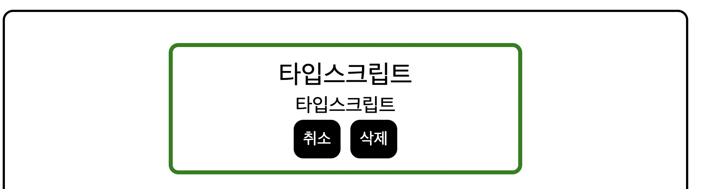
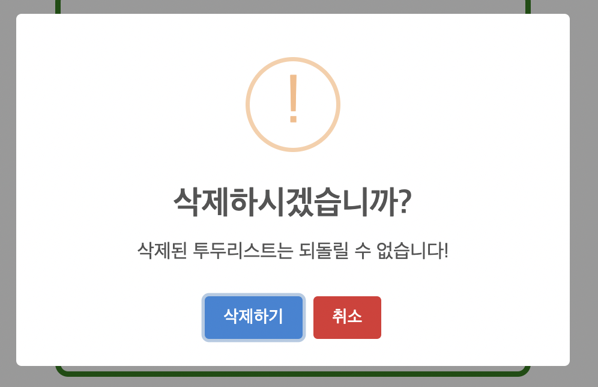
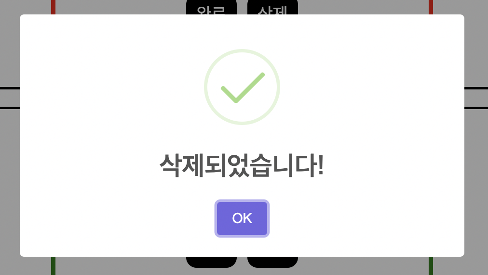

# 내일배움캠프 12주차 개인과제

## 프로젝트명 : 타입스크립트 Todo-list 
## 프로젝트 내용 : 타입스크립트를 활용한 Todo-list 만들기 
## 개발 일정 : 2023.12.15 - 2023.12.15 
## 사용 스택 : 
 

# 웹페이지 설명

## 메인페이지

## 등록하기

제목과 내용을 채워 투두리스트를 등록할 수 있다.
Enter 혹은 등록하기 버튼을 클릭하여 등록할 수 있다.

## 완료

완료 버튼 클릭 시 완료 버튼이 취소 버튼으로 바뀌고
완료된 투두리스트는 화면 밑으로 따로 분리된다.

## 삭제

삭제 버튼 클릭 시 삭제하시겠습니까 경고창을 띄운다.
경고창 안의 삭제하기 버튼을 클릭하면 투두리스트가 삭제된다.